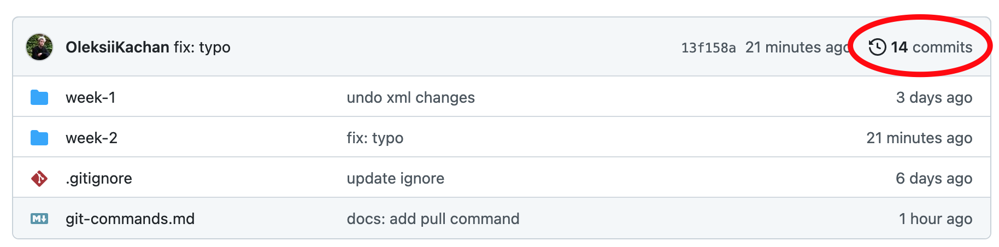
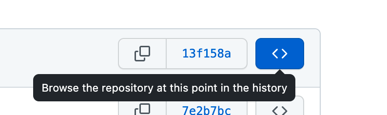
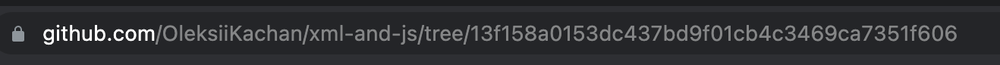

# How to submit assignment

1. Open your githb repo and click on commits history
   
2. Find the most up-to-date commit with your assignment
3. Click on `Browse the repository at this point in the history`
   
4. It will add commit hash to url. Copy url and submit via blackboard
   
