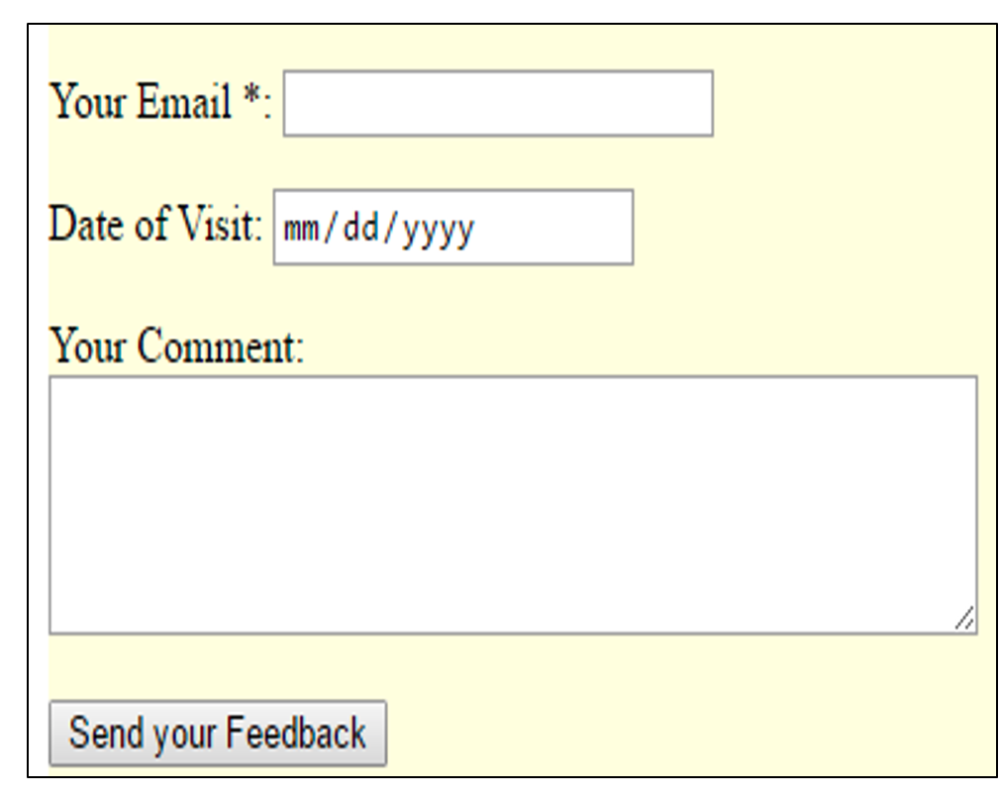

# Evaluation 2

1. Design the following webform, and add some CSS style (like color)

2. Using JavaScript, develop a program which collect form data and display them, when user clicks on “send your feedback” button
