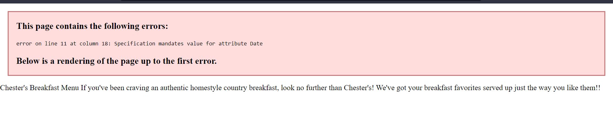
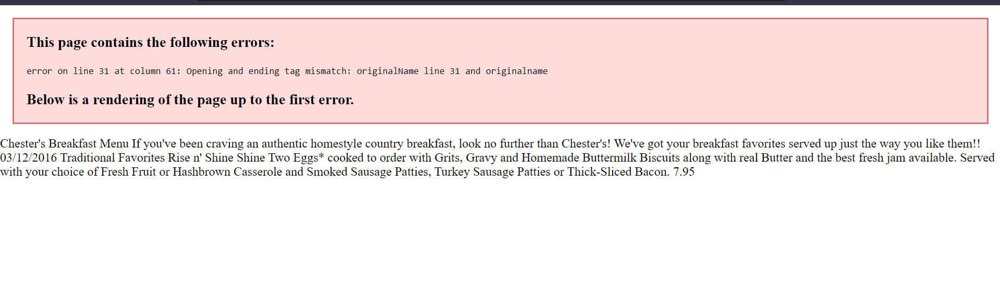
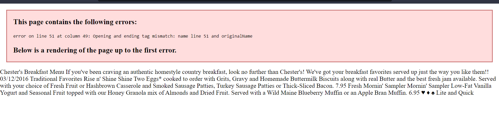
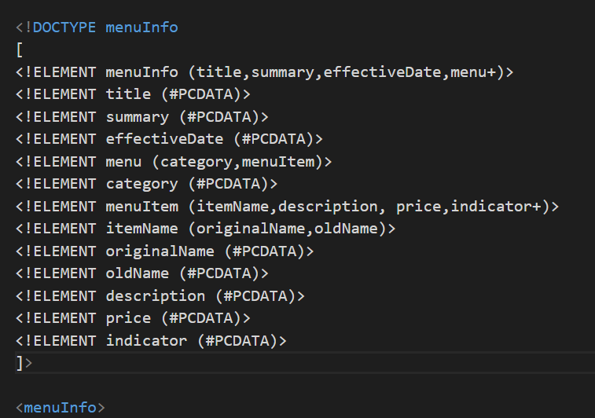

- 1


-The error at line number 11 is due to improper tag name, it contains space and tag names cannot have spaces between them. We fix the error by removing the space. 



-This error is because opening and closing tags do not match each other.
Here, N is capital in opening and small case in closing tag
```xml
<originalName> Fresh Mornin' Sampler </originalname>
```


- The 3rd error is also same as 2nd error, opening and closing tags do not match
```xml
<name> Oatmeal Breakfast </originalName>
```

- 2
The Content inside the CDATA block will not be treated as markup and will be displayed as it is

- 3 
Comment added 
<!-- Vishesh Makwana - N01495694 -->

- 4

Prolog is 
```xml
<?xml version="1.0" encoding="UTF-8" standalone="yes" ?>
```
Document body- All the tags

- 5
