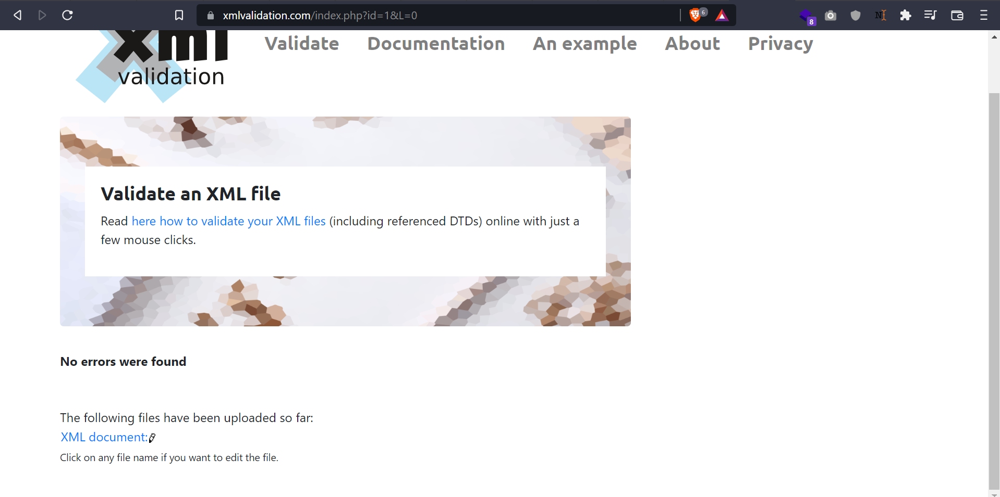
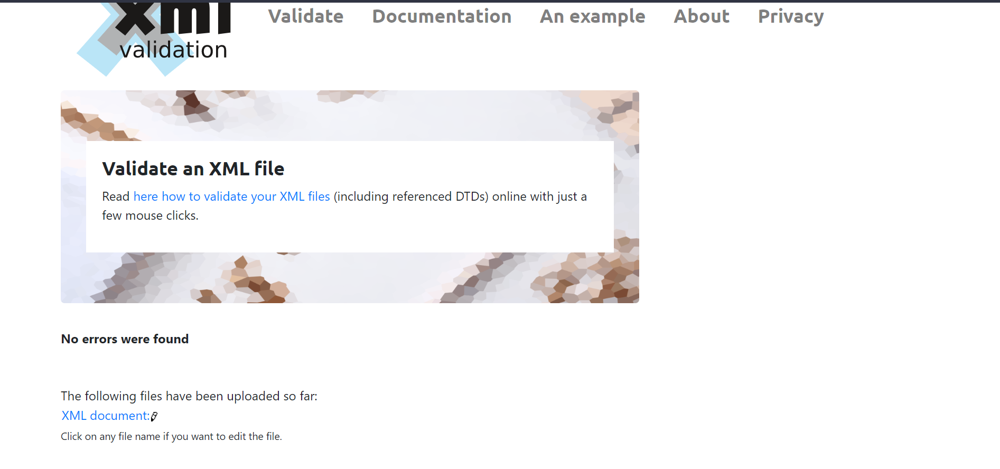

- 2 Added inline DTD for the file provided. Validation for the dtd and xml above.

- 3 Generated and validated xsd for the provided file

- 4 
My thought process for both these declaration are DTD has less control over XML compared to XSD, DTD defines the structure of the document while XSD describe in details about the contents of the XML file. 