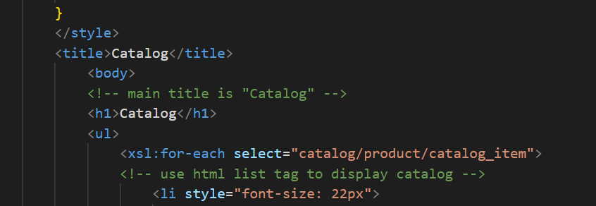
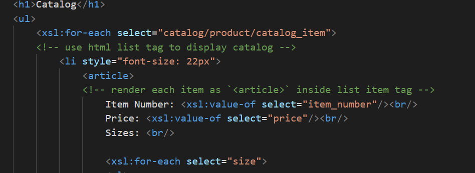
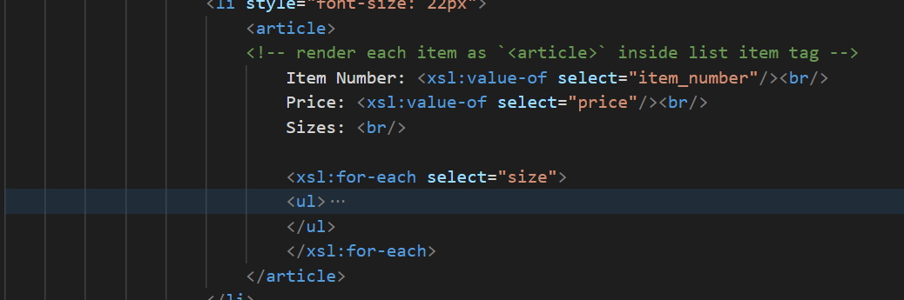
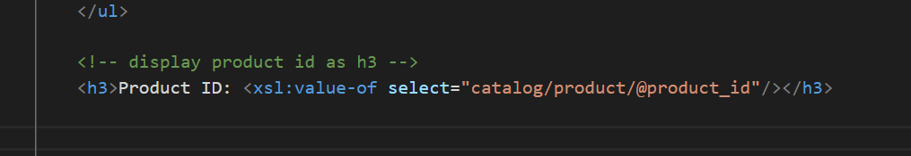
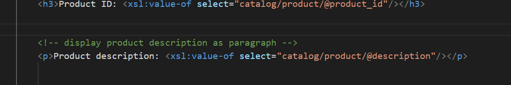
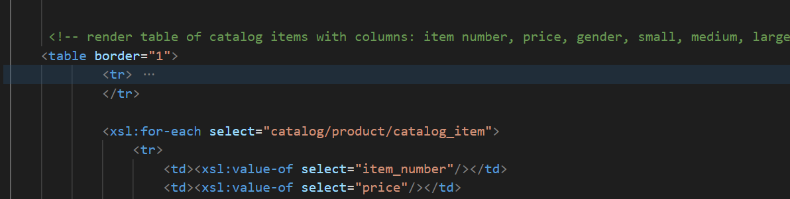
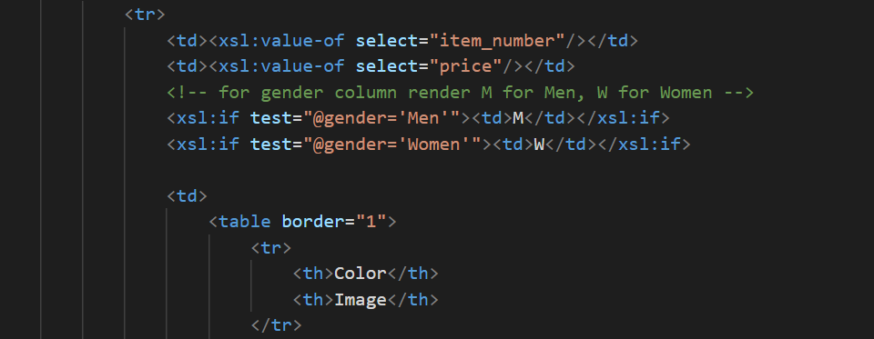
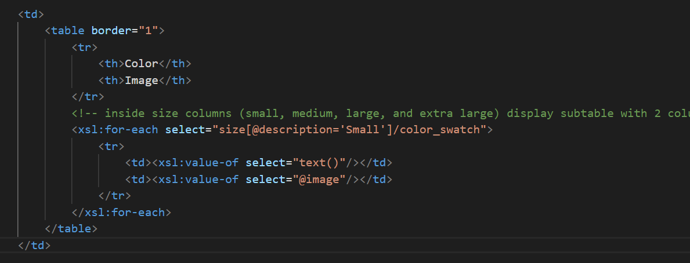

- 1
Adding title Cataloge to the page

- 2
Using li tag for cataloug using correct xpath for catalog
 

 - 3
 using article tag and fetching correct details using xpath
 

 - 4
 Displaying Id using h3 by fetching data using xpath
 

 - 5
 Displaying product description using p by fetching data using xpath
 

 - 6
 creating table and fetching details as mentioned in the description
 

 - 7
 Using if for displaying W for women or M for men
 

 - 8
 creating table inside table and fetching details using correct xpath
 
