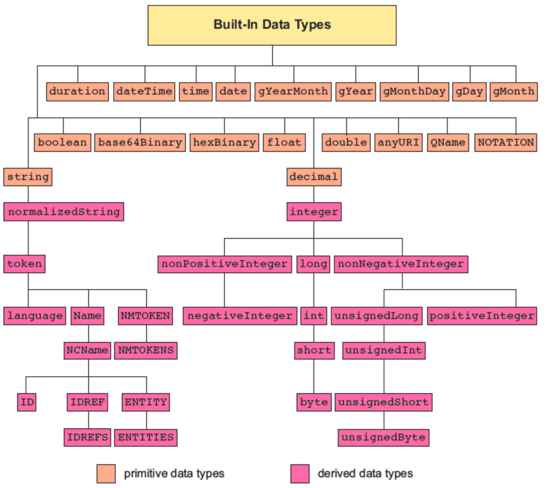

# XML Schema (XSD)

## Table of content

- [Definition](#definition)
  - [Referring to a schema](#referring-to-a-schema)
  - [XSD document](#xsd-document)
- [XML Schema vs DTD](#xml-schema-vs-dtd)
- [XML Schema elements](#xml-schema-elements)
  - [Simple elements](#simple-elements)
  - [Complex elements](#complex-elements)
- [XML Schema attributes](#xml-schema-attributes)
- [XML Schema built-in data types](#xml-schema-built-in-data-types)
  - [String Data Types](#string-data-types)
  - [Numeric Data Types](#numeric-data-types)
  - [Date & Time Data Types](#date---time-data-types)
- [Schema design](#schema-design)

## Definition

Like DTDs, **XML Schemas** are used for defining XML vocabularies.

They describe the structure and content of XML documents in more detail than DTDs.

**XSD (XML Schema Definition)** - a recommendation of the World Wide Web Consortium (W3C), specifies how to formally describe the elements in an Extensible Markup Language (XML) document.

In general, a schema is any type of model document that defines the structure of something, such as database layout or documents.
_For example, DTDs are a type of schema._

The term _schema_ is often interchangeable with the word _vocabulary_.

### Referring to a schema

To refer to a DTD in an XML document, the reference goes before the root element:

```xml
<?xml version="1.0"?>
<!DOCTYPE rootElement SYSTEM "url">
<rootElement> ... </rootElement>
```

To refer to an XML Schema in an XML document, the reference goes in the root element:

```xml
<?xml version="1.0"?>
<rootElement
  xmlns:xsi="http://www.w3.org/2001/XMLSchema-instance" (The XML Schema Instance reference is required)
  xsi:noNamespaceSchemaLocation="url.xsd" (This is where your XML Schema definition can be found)>
  ...
</rootElement>
```

### XSD document

- The file extension is `.xsd`
- The root element is `<schema>`
- The XSD starts like this:

```xml
<xs:schema xmlns:xs="http://www.w3.rg/2001/XMLSchema">
```

## XML Schema vs DTD

XML Schemas are created using basic XML, whereas DTDs utilize a separate syntax

**DTD:**

```xml
<!ELEMENT first (#PCDATA)>
```

**XSD:**

```xml
  <element name="first" type="string"/>
```

**XML Schemas** allows you to validate text element content based on built-in and user-defined _data types_

## XML Schema elements

A **simple** element is one that contains text and nothing else

- cannot have attributes
- cannot contain other elements
- cannot be empty
- However, the text can be of many different types, and may have various restrictions applied to it

If an element isn’t **simple**, it’s **complex**:

- may have attributes
  – may be empty, or it may contain text, other elements, or both text and other elements

### Simple elements

Simple element is defined as

```xml
<xs:element name="name" type="type" />
```

The most common values for type are

- `xs:boolean`
- `xs:date`
- `xs:decimal`
- `xs:integer`
- `xs:string`
- `xs:time`

Other possible attributes of a **simple** element:

- `default="default value"`- if no other value is provided
- `fixed="value"` - no other values can be used

### Complex elements

Complex Element is an XML element which can contain other elements and/or attributes. We can create a complex element in two ways:

- Define a complex type and then create an element using the type attribute

```xml
<xs:complexType name="StudentType">
   <xs:sequence>
      <xs:element name="firstname" type="xs:string"/>
      <xs:element name="lastname" type="xs:string"/>
      <xs:element name="nickname" type="xs:string"/>
      <xs:element name="marks" type="xs:positiveInteger"/>
   </xs:sequence>
   <xs:attribute name="rollno" type="xs:positiveInteger"/>
</xs:complexType>
<xs:element name="student" type="StudentType" />
```

- Define a complex type directly by naming

```xml
<xs:element name="student">
   <xs:complexType>
      <xs:sequence>
         <xs:element name="firstname" type="xs:string"/>
         <xs:element name="lastname" type="xs:string"/>
         <xs:element name="nickname" type="xs:string"/>
         <xs:element name="marks" type="xs:positiveInteger"/>
      </xs:sequence>
   <xs:attribute name="rollno" type="xs:positiveInteger"/>
   </xs:complexType>
<xs:element>
```

## XML Schema attributes

Attributes are always declared as simple types.

```xml
<xs:attribute name="name" type="type" />
```

where `name` and `type` are the same as for `xs:element`

Other attributes:

- `default="default value"` - same as for `xs:element`
- `fixed="value"` - same as for `xs:element`
- `use="optional"`(default) - the attribute is not required
- `use="required"` - the attribute is required

## XML Schema built-in data types

XML Schema divides its built-in data types into two classes—primitive and derived:

- A **primitive data type**, also called a base type, is one of 19 fundamental data types that are not defined in terms of other types
- A **derived data type** is one of 25 data types that are developed from one of the base types



### String Data Types

| Data type             | Description                                                                                                                        |
| --------------------- | ---------------------------------------------------------------------------------------------------------------------------------- |
| `xs:string`           | A text string containing all legal characters from the ISO/IEC character set, including all white space characters                 |
| `xs:normalizedString` | A text string in which all white space characters are replaced with blank spaces                                                   |
| `xs:token`            | A text string in which adjoining blank spaces are replaced with a single blank space, and opening and closing spaces are removed   |
| `xs:NMTOKEN`          | A text string containing valid XML names with no white space                                                                       |
| `xs:NMTOKENS`         | A list of NMTOKEN data values separated by white space                                                                             |
| `xs:Name`             | A text string similar to the NMTOKEN data type except that names must begin with a letter or the colon (:) or hyphen (-) character |
| `xs:NCName`           | A _non-colonized name_ - derived from the Name data type but restricting the use of colons anywhere in the name                    |
| `xs:ID`               | A unique ID name found nowhere else in the instance document                                                                       |
| `xs:IDREF`            | A reference to an ID value found in the instance document                                                                          |
| `xs:IDREFS`           | A list of ID references separated by white space                                                                                   |
| `xs:ENTITY`           | A value matching an unparsed entity defined in a DTD                                                                               |
| `xs:ENTITIES`         | A list of entity values matching unparsed entities defined in a DTD                                                                |

### Numeric Data Types

| Data type               | Description                                                                                                                                                                                 |
| ----------------------- | ------------------------------------------------------------------------------------------------------------------------------------------------------------------------------------------- |
| `xs:decimal`            | Any decimal number in which the decimal separator is always a dot (.) with a leading + or - character allowed; no nonnumeric characters are allowed, nor is exponential notation            |
| `xs:integer`            | Any integer                                                                                                                                                                                 |
| `xs:nonPositiveInteger` | <= 0                                                                                                                                                                                        |
| `xs:negativeInteger`    | < 0                                                                                                                                                                                         |
| `xs:nonNegativeInteger` | >= 0                                                                                                                                                                                        |
| `xs:positiveInteger`    | > 0                                                                                                                                                                                         |
| `xs:float`              | Any floating point number allowing decimal values and values in scientific notation; infinite values can be represented by `-INF` and `INF`; non-numeric values can be represented by `NaN` |
| `xs:double`             | Any double precision floating point number                                                                                                                                                  |
| `xs:boolean`            | `true`, `false`, `1`, `0`                                                                                                                                                                   |

### Date & Time Data Types

| Data Type          | Description                                                                                                                                                                                                                                                  |
| ------------------ | ------------------------------------------------------------------------------------------------------------------------------------------------------------------------------------------------------------------------------------------------------------ |
| `xs:dateTime`      | A date and time entered in the format `yyyy-mm-ddThh:mm:ss` where `yyyy` is the four-digit year, `mm` is the two-digit month, `dd` is the two-digit day, `hh` is the two-digit hour, `mm` is the two-digit minute, `ss` is the two-digit second              |
| `xs:date`          | `yyyy-mm-dd`                                                                                                                                                                                                                                                 |
| `xs:time`          | `hh:mm:ss`                                                                                                                                                                                                                                                   |
| `xs:gYearMonthDay` | A date based on the _Gregorian calendar_ entered in the format `yyyy-mm-dd` (equivalent to `xs:date`)                                                                                                                                                        |
| `xs:gYearMonthh`   | `yyyy-mm`                                                                                                                                                                                                                                                    |
| `xs:gYear`         | `yyyy`                                                                                                                                                                                                                                                       |
| `xs:gMonthDay`     | `--mm-dd`                                                                                                                                                                                                                                                    |
| `xs:gMonth`        | `--mm`                                                                                                                                                                                                                                                       |
| `xs:gDay`          | `--dd`                                                                                                                                                                                                                                                       |
| `xs:duration`      | A time duration entered in the format `PyYmMdDhHmMsS` where y, m, d, h, m, and s are the duration values in years, months, days, hours, minutes, and seconds, respectively. An optional negative sign is also permitted to indicate a negative time duration |

## Schema design

There are three basic schema designs:

- Flat Catalog
- Russian Doll
- Venetian Blind

### Flat Catalog Design

```xml
<xs:schema xmlns:xs="http://www.w3.org/2001/XMLSchema">
  <xs:element name="students">
    <xs:complexType>
      <xs:sequence>
        <xs:element ref="student" minOccurs="1" maxOccurs="unbounded">
      </xs:sequence>
    </xs:complexType>
  </xs:element>
  <xs:element name="student">
    <xs:complexType>
      <xs:sequence>
        <xs:element ref="lastName" />
        <xs:element ref="firstName" />
        <xs:element ref="examDate" />
        <xs:element ref="pretest" />
      </xs:sequence>
      <xs:attribute ref="studId" use="required"/>
      <xs:attribute ref="courseId" use="required"/>
    </xs:complexType>
  </xs:element>
  <xs:element name="lastName" type="xs:string" />
  <xs:element name="firstName" type="xs:string" />
  <xs:element name="examDate" type="xs:date" />
  ...
</xs:schema>
```

### Russian Doll Design

```xml
<xs:schema xmlns:xs="http://www.w3.org/2001/XMLSchema">
  <xs:element name="students">
    <xs:complexType>
      <xs:sequence>
        <xs:element name="lastName" type="xs:string" />
        <xs:element name="firstName" type="xs:string" />
        <xs:element name="examDate" type="xs:date" />
        <xs:element name="pretest">
          <xs:complextType>
            <xs:simpleContent>
              <xs:extension base="pretestType">
                <xs:attribute name="level" use="required">
                  <xs:simpleType>
                    <xs:restriction base="xs:string">
                      <xs:enumeration value="L"/>
                      <xs:enumeration value="M"/>
                      <xs:enumeration value="H"/>
                    </xs:restriction>
                  </xs:simpleType>
                </xs:attribute>
              </xs:extension>
            </xs:simpleContent>
          </xs:complexType>
        </xs:element>
        <xs:element name="score" type="pretestType" minOccurs="0" maxOccurs="unbounded"/>
      </xs:sequence>
    </xs:complexType>
  </xs:element>
  ...
</xs:schema>
```

### Venetian Blind Design

```xml
<xs:schema xmlns:xs="http://www.w3.org/2001/XMLSchema">
  <xs:element name="students">
    <xs:complexType>
      <xs:sequence>
        <xs:element name="student" type="studentType" minOccurs="1" maxOccurs="unbounded">
      </xs:sequence>
    </xs:complexType>
  </xs:element>
  <xs:complexType name="studentType">
    <xs:group ref="childElements" />
    <xs:group ref="studentAttrs"/>
  </xs:complexType>
  <xs:group name="childElements">
    <xs:element name="lastName" type="xs:string" />
    <xs:element name="firstName" type="xs:string" />
    <xs:element name="examDate" type="xs:date" />
  <xs:group>
  ...
</xs:schema>
```
