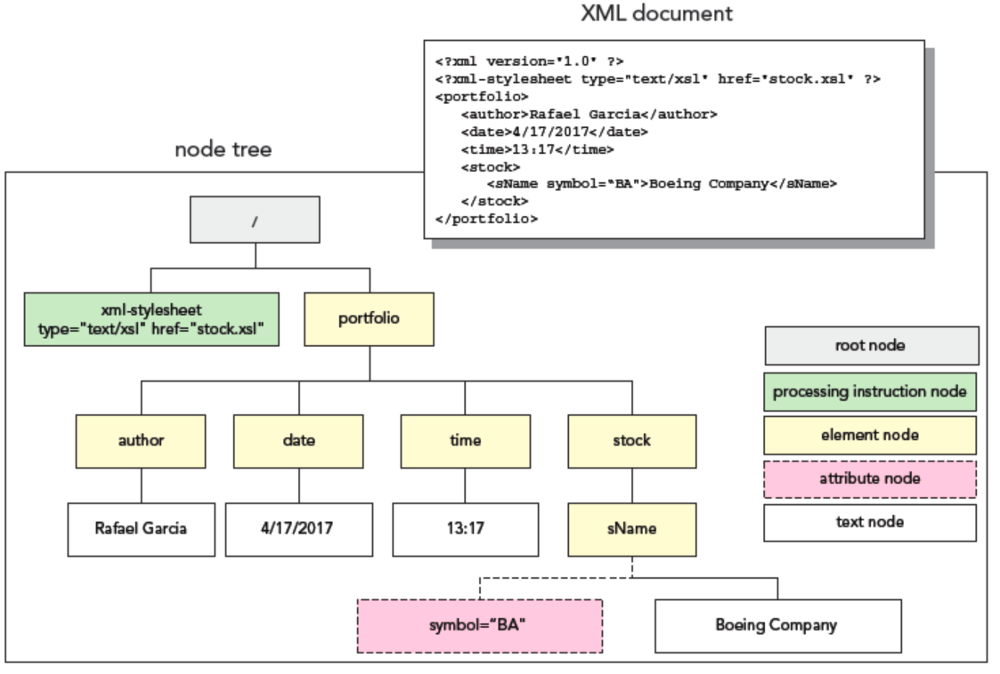

# XPath

## Table of content

- [XPath](#xpath)
  - [Nodes](#nodes)
    - [Node tree](#node-tree)
  - [Syntax](#syntax)
    - [Examples](#examples)
  - [Predicate](#predicate)
    - [Example](#example)
  - [Operators](#operators)
    - [Comparison Operators](#comparison-operators)
    - [Boolean Operators](#boolean-operators)
    - [Number Operators](#number-operators)
    - [Node Operators](#node-operators)
  - [Functions](#functions)
    - [Number Functions](#number-functions)
    - [Node Functions](#node-functions)

**XPath** is a query language that is used for traversing through an XML document. It is used commonly to search particular elements or attributes with matching patterns.

A **node** is any item within the tree structure of the document.
A collection of nodes is called a **node set**.

## Nodes

XPath specification specifies seven types of nodes which can be the output of execution of the XPath expression:

- Root node
- Element node
- Text node
- Attribute node
- Comment node
- Processing-Instruction node
- Namespace node

### Node tree

Various nodes from the source document are organized into a **node tree**, with the **root node** or **document node** at the top of the tree.

**Element node** refers to an element from the source document

**Attribute node** refers to an element’s attribute



## Syntax

| Expression  | Description                                                     |
| ----------- | --------------------------------------------------------------- |
| `node-name` | Select all nodes with the given name "nodename"                 |
| `/`         | Selection starts from the root node                             |
| `//`        | Selection starts from the current node that match the selection |
| `.`         | Selects the current node                                        |
| `..`        | Selects the parent of the current node                          |
| `@`         | Selects attributes                                              |

Location path specifies the location of node in XML document. This path can be **absolute** or **relative**. If location path starts with root node or with '/' then it is an absolute path.

### Examples

| Expression        | Description                                                                                                                       |
| ----------------- | --------------------------------------------------------------------------------------------------------------------------------- |
| `bookstore`       | Select all nodes with the name "bookstore"                                                                                        |
| `/bookstore`      | Select the root element bookstore Note: If the path starts with a slash ( / ) it always represents an absolute path to an element |
| bookstore//book   | Select all book elements that are children of bookstore                                                                           |
| `//book`          | Select all book elements no matter where they are in the document                                                                 |
| `bookstore//book` | Select all book elements that are descendant of the bookstore element, no matter where they are under the bookstore element       |
| `//@lang`         | Select all attributes that are named lang                                                                                         |

## Predicate

**Predicates** are used to find a specific node or a node that contains a specific value.

**Predicates** are always embedded in square brackets.

```xml
/element1/element2[predicate]
```

### Example

Select the first book element that is the child of the bookstore element:

```xml
/bookstore/book[1]
```

Select all the title elements that have a "lang" attribute with a value of "en"

```xml
//title[@lang='en']
```

## Operators

### Comparison Operators

| Operator | Description               |
| -------- | ------------------------- |
| `=`      | equals to                 |
| `!=`     | not equal to              |
| `<`      | less than                 |
| `>`      | greater than              |
| `<=`     | less than or equals to    |
| `>=`     | greater than or equals to |

### Boolean Operators

| Operator | Description                                      |
| -------- | ------------------------------------------------ |
| `and`    | both conditions to be satisfied                  |
| `or`     | any of the conditions to be satisfied            |
| `not()`  | function to check condition not to be satisfied. |

### Number Operators

| Operator | Description    |
| -------- | -------------- |
| `+`      | addition       |
| `-`      | subtraction    |
| `*`      | multiplication |
| `div`    | division       |
| `mod`    | modulus        |

### Node Operators

| Operator | Description                       |
| -------- | --------------------------------- |
| `/`      | select node under a specific node |
| `//`     | select node from root node        |
| `[...]`  | check node value                  |
| `\|`     | union of two node sets            |

## Functions

### Number Functions

| Operator    | Description                                                |
| ----------- | ---------------------------------------------------------- |
| `ceiling()` | return the smallest integer larger than the value provided |
| `floor()`   | return the largest integer smaller than the value provided |
| `round()`   | return the rounded value to nearest integer                |
| `sum()`     | return the sum of two numbers                              |

### Node Functions

| Operator                   | Description                                   |
| -------------------------- | --------------------------------------------- |
| `comment()`                | select nodes which are comments               |
| `node()`                   | select all kinds of nodes                     |
| `processing-instruction()` | select nodes which are processing instruction |
| `text()`                   | select a text node                            |
| `name()`                   | return the name of the node                   |
| `position()`               | return the position of the node               |
| `last()`                   | select the last node relative to current node |

```xml
//orders/order[position()] - get the count of orders
//qty/text() - get all text nodes from inside <qty>
concat(//description/text() , //qty/text())
//description/text() | //qty/text()
```
