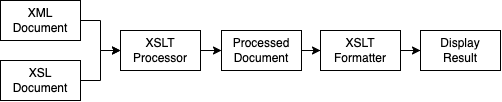

# XSLT

## Table of content

- [XSLT](#xslt)
  - [Table of content](#table-of-content)
  - [How does XSLT work](#how-does-xslt-work)
  - [Structure of XSLT](#structure-of-xslt)
    - [How to link XSLT and XML documents](#how-to-link-xslt-and-xml-documents)
  - [How to view xsl in browser](#how-to-view-xsl-in-browser)
  - [Syntax](#syntax)
    - [`<xsl:stylesheet>`](#--xsl-stylesheet--)
    - [`<xsl:template>`](#--xsl-template--)
    - [`<xsl:value-of>`](#--xsl-value-of--)
    - [`<xsl:for-each>`](#--xsl-for-each--)
    - [`<xsl:if>`](#--xsl-if--)
    - [`<xsl:sort>`](#--xsl-sort--)
    - [`<xsl:choose>`](#--xsl-choose--)
    - [`<xsl:key>`](#--xsl-key--)
    - [`<xsl:apply-template>`](#--xsl-apply-template--)
    - [`<xsl:import>`](#--xsl-import--)

XSL document specifies how a browser should render an XML document.

Main parts of XSL Document:

- **XSLT**: It is a language for transforming XML documents
  into various other types of documents
- **XPath**: It is a language for navigating in XML documents
- **XSL-FO**: It is a language for formatting XML documents

**XSLT** stands for _Extensible Stylesheet Language Transformations_

It is a declarative language.

It provides the ability to transform XML data from one format to another automatically.

An XSLT stylesheet is used to define the transformation rules to be applied on the target XML document. XSLT stylesheet is written in XML format. XSLT Processor takes the XSLT stylesheet and applies the transformation rules on the target XML document and then it generates a formatted document in the form of XML, HTML, or text format. This formatted document is then utilized by XSLT formatter to generate the actual output which is to be displayed to the end-user.

## How does XSLT work



XSLT is based on the idea of templates.

The basic concept is that you specify a number of templates that each match XML in the source document.

When the matching XML is found, the template is activated, and its contents are added to the output document.

The stylesheet element needs to be placed in the `http://www.w3.org/1999/XSL/Transform` namespace.

## Structure of XSLT

Every XSLT stylesheet has the following basic structure:

```xml
 <?xml version="1.0" ?>
     <xsl:stylesheet version="value" xmlns:xsl="http://www.w3.org/1999/XSL/Transform">
     stylesheet contents
  </xsl:stylesheet>
```

Where:

- `value` is the XSLT version
- `stylesheet contents` are the elements and attributes specific to the stylesheet

### How to link XSLT and XML documents

An XSLT style sheet is attached to an XML document by adding the following processing instruction near the top of the XML document prior to the root element:

```xml
<?xml-stylesheet type="text/xsl" href="url" ?>
```

Where:

- `url` is the path to the XSLT stylesheet file

## How to view xsl in browser

```sh
npm install -g http-server
http-server
```

## Syntax

### `<xsl:stylesheet>`

This is the all-encompassing document element used to hold all your templates.

### `<xsl:template>`

Defines a way to reuse templates in order to generate the desired output for nodes of a particular type/context.

```xml
<xsl:template
   name=Qname
   match=Pattern
   priority=number
   mode=QName>
</xsl:template>
```

| Attribute  | Description                                                                                                                     |
| ---------- | ------------------------------------------------------------------------------------------------------------------------------- |
| `name`     | Name of the element on which template is to be applied                                                                          |
| `match`    | Pattern which signifies the element(s) on which template is to be applied                                                       |
| `priority` | Priority number of a template. Matching template with low priority is not considered in from in front of high priority template |
| `mode`     | Allows element to be processed multiple times to produce a different result each time                                           |

### `<xsl:value-of>`

`<xsl:value-of>` tag puts the value of the selected node as per XPath expression, as text.

```xml
<xsl:value-of
   select=Expression
   disable-output-escaping="yes" | "no" >
</xsl:value-of>
```

| Attribute                 | Description                                                                  |
| ------------------------- | ---------------------------------------------------------------------------- |
| `select`                  | XPath Expression to be evaluated in current context                          |
| `disable-output-escaping` | Default-"no". If "yes", output text will not escape xml characters from text |

Example:

```xml
 <td><xsl:value-of select="@rollno"/></td>
```

### `<xsl:for-each>`

`<xsl:for-each>` tag applies a template repeatedly for each node.

```xml
<xsl:for-each
   select=Expression>
</xsl:for-each>
```

| Attribute | Description                                                                                      |
| --------- | ------------------------------------------------------------------------------------------------ |
| `select`  | XPath Expression to be evaluated in current context to determine the set of nodes to be iterated |

Example:

```xml
<xsl:for-each select="class/student">
  <tr>
    <td><xsl:value-of select="@rollno"/></td>
    <td><xsl:value-of select="firstname"/></td>
    <td><xsl:value-of select="lastname"/></td>
    <td><xsl:value-of select="nickname"/></td>
    <td><xsl:value-of select="marks"/></td>
  </tr>
</xsl:for-each>
```

### `<xsl:if>`

`<xsl:if>` tag specifies a conditional test against the content of nodes.

```xml
<xsl:if
  test=boolean-expression>
</xsl:if>
```

| Attribute | Description                           |
| --------- | ------------------------------------- |
| `test`    | The condition in the xml data to test |

Example:

```xml
<xsl:for-each select="class/student">
  <xsl:if test="marks > 90">
    <tr>
      <td><xsl:value-of select="@rollno"/></td>
      <td><xsl:value-of select="firstname"/></td>
      <td><xsl:value-of select="lastname"/></td>
      <td><xsl:value-of select="nickname"/></td>
      <td><xsl:value-of select="marks"/></td>
    </tr>
  </xsl:if>
</xsl:for-each>
```

### `<xsl:sort>`

`<xsl:sort>` tag specifies a sort criteria on the nodes.

```xml
<xsl:sort
   select=string-expression
   lang=nmtoken
   data-type="text" | "number" | QName
   order="ascending" | "descending"
   case-order="upper-first" | "lower-first">
</xsl:sort>
```

| Attribute    | Description                                                         |
| ------------ | ------------------------------------------------------------------- |
| `select`     | Sorting key of the node                                             |
| `lang`       | Language alphabet used to determine sort order                      |
| `data-type`  | Data type of the text                                               |
| `order`      | Sorting order. Default is "ascending"                               |
| `case-order` | Sorting order of string by capitalization. Default is "upper-first" |

Example:

```xml
<xsl:for-each select="class/student">
  <xsl:sort select="firstname"/>
  <tr>
    <td><xsl:value-of select="@rollno"/></td>
    <td><xsl:value-of select="firstname"/></td>
    <td><xsl:value-of select="lastname"/></td>
    <td><xsl:value-of select="nickname"/></td>
    <td><xsl:value-of select="marks"/></td>
  </tr>
</xsl:for-each>
```

### `<xsl:choose>`

`<xsl:choose>` tag specifies a multiple conditional tests against the content of nodes in conjunction with the `<xsl:otherwise>` and `<xsl:when>` elements. Similar to `switch-case` in javascript and other languages.

```xml
<xsl:choose>
</xsl:choose>
```

Example:

```xml
<xsl:choose>
  <xsl:when test="marks > 90">High</xsl:when>
  <xsl:when test="marks > 85">Medium</xsl:when>
  <xsl:otherwise>Low</xsl:otherwise>
</xsl:choose>
```

### `<xsl:key>`

`<xsl:key>` tag element specifies a named name-value pair assigned to a specific element in an XML document. This key is used with the `key()` function in **XPath** expressions to access the assigned elements in an XML document.

```xml
<xsl:key
   name=QName
   match=Pattern
   use=Expression >
</xsl:key>
```

| Attribute | Description                                                         |
| --------- | ------------------------------------------------------------------- |
| `name`    | Name of the key to be used                                          |
| `match`   | Patterns used to identify a node that holds this key                |
| `use`     | XPath expression to identify the value of the nodes of xml document |

Example:

```xml
<xsl:stylesheet version="1.0" xmlns:xsl = "http://www.w3.org/1999/XSL/Transform">
  <xsl:key name="firstname-search" match="student" use="firstname"/>
  <xsl:template match="/">
    <html>
      <body>
        <h2>Students</h2>
        <table border = "1">
          <tr bgcolor = "#9acd32">
            <th>Roll No</th>
            <th>First Name</th>
            <th>Last Name</th>
            <th>Nick Name</th>
            <th>Marks</th>
          </tr>

          <xsl:for-each select = "key('firstname-search', 'Dinkar')">
            <tr>
              <td><xsl:value-of select = "@rollno"/></td>
              <td><xsl:value-of select = "firstname"/></td>
              <td><xsl:value-of select = "lastname"/></td>
              <td><xsl:value-of select = "nickname"/></td>
              <td><xsl:value-of select = "marks"/></td>
            </tr>
          </xsl:for-each>
        </table>
      </body>
    </html>
  </xsl:template>
</xsl:stylesheet>
```

### `<xsl:apply-template>`

`<xsl:apply-template>` tag signals the XSLT processor to find the appropriate template to apply, based on the type and context of each selected node.

```xml
<xsl:apply-template
   select=Expression
   mode=QName >
</xsl:apply-template>
```

| Attribute | Description                                                                                                                  |
| --------- | ---------------------------------------------------------------------------------------------------------------------------- |
| `select`  | Used to process nodes selected by an XPath expression, instead of processing all the children                                |
| `mode`    | Allows an element as specified by its Qualified Names to be processed multiple times, each time producing a different result |

Example:

```xml
<?xml version="1.0" encoding="UTF-8"?>
<xsl:stylesheet version="1.0" xmlns:xsl="http://www.w3.org/1999/XSL/Transform">
  <xsl:template match="/">
    <html>
      <body>
        <h2>Students</h2>
        <xsl:apply-templates select = "class/student" />
      </body>
    </html>
  </xsl:template>

  <xsl:template match = "class/student">
    <xsl:apply-templates select = "@rollno" />
    <xsl:apply-templates select = "firstname" />
    <xsl:apply-templates select = "lastname" />
    <xsl:apply-templates select = "nickname" />
    <xsl:apply-templates select = "marks" />
    <br />
  </xsl:template>

  <xsl:template match = "@rollno">
    <span style = "font-size = 22px;">
      <xsl:value-of select = "." />
    </span>
    <br />
  </xsl:template>

  <xsl:template match = "firstname">
    First Name:
    <span style = "color:blue;">
      <xsl:value-of select = "." />
    </span>
    <br />
  </xsl:template>

  <xsl:template match = "lastname">
    Last Name:
    <span style = "color:green;">
      <xsl:value-of select = "." />
    </span>
    <br />
  </xsl:template>

  <xsl:template match = "nickname">
    Nickname:
    <span style = "color:red;">
      <xsl:value-of select = "." />
    </span>
    <br />
  </xsl:template>

  <xsl:template match = "marks">
    Marks:
    <span style = "color:gray;">
      <xsl:value-of select = "." />
    </span>
    <br />
  </xsl:template>
</xsl:stylesheet>
```

### `<xsl:import>`

`<xsl:import>` tag imports the contents of one stylesheet into another. Importing a style sheet has higher precedence over imported stylesheet.

```xml
<xsl:import href="uri">
</xsl:import>
```

| Attribute | Description                                |
| --------- | ------------------------------------------ |
| `href`    | path of the xslt stylesheet to be imported |

Example:

```xml
<?xml version="1.0" encoding="UTF-8"?>
<xsl:stylesheet version="1.0" xmlns:xsl="http://www.w3.org/1999/XSL/Transform">
   <xsl:import href="students.xsl"/>
   <xsl:template match="/">
      <xsl:apply-imports/>
   </xsl:template>
</xsl:stylesheet>
```
